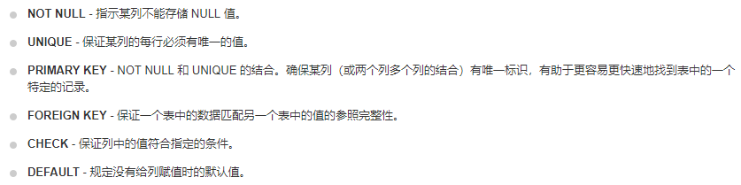
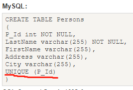
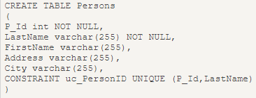
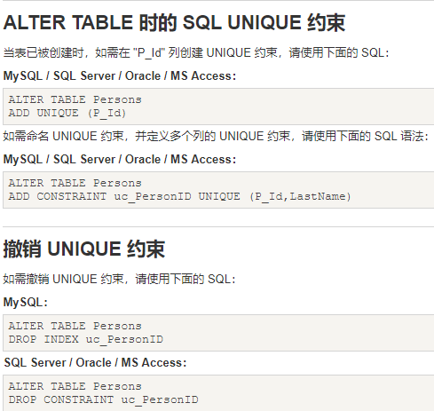
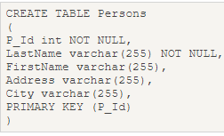
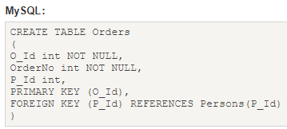
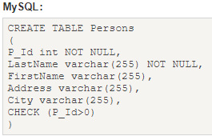
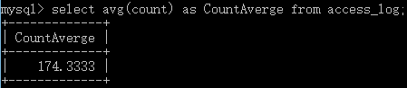

### Mysql笔记
1. DDL:数据定义语言
2. DML:数据操作语言
3. DCL:数据控制语言
4. DQL:数据查询语言

一、 查询指定列或全部列
* 查询指定列:
 ```SQL
 SELECT
    lastname, firstname, jobtitle
FROM
    employees;
 ```
* 查询所有列:
```SQL
SELECT * FROM  employees
```
* 查询唯一不同的值
```SQL
SELECT DISTINCT country FROM Websites;
```
* AND运算符
```SQL
SELECT * FROM Websites WHERE country='CN' AND alexa > 50;
```
* OR运算符
```SQL
SELECT * FROM Websites WHERE country='USA' OR country='CN';
```
* 批量查询:
```SQL
select *from websites where id in(1,2);
```
* 限定查询数目
```SQL
SELECT *FROM websites LIMIT 2
```
```SQL
SELECT *FROM stu LIMIT 4,3;
##4为偏移数，3为查询数
```
```SQL
SELECT *FROM stu LIMIT 5 OFFSET 2;
##5为查询数，2为偏移数
```
*  查询以G开头的所有客户
```SQL
SELECT * FROM Websites WHERE name LIKE 'G%';
```
* 查询name包含模式"oo"的所有客户
```SQL
SELECT * FROM Websites WHERE name LIKE '%oo%';
```
* 查询name不包含模式"oo"的所有客户
```SQL
SELECT * FROM Websites WHERE name NOT LIKE '%oo%';
```
```SQL
'%a' 以a结尾的数据
'a%' 以a开头的数据
'%a%' 含有a的数据
'_a_' 三位且中间字母是a的
'_a'  两位且结尾字母是a的
'a_'  两位且开头字母是a的
```
* IN操作符
```SQL
SELECT * FROM Websites WHERE name IN ('Google','菜鸟教程');
##等价于: select * from Websites where name='Google' or name='菜鸟教程';
```
* between操作符
 1. 不介于1和20 之间
 ```SQL
 SELECT * FROM Websites WHERE alexa NOT BETWEEN 1 AND 20;
 ```
 2. 带有IN的BETWEEN
 ```SQL
 SELECT *FROM websites WHERE (alexa BETWEEN 1 AND 20) AND NOT country IN('USA','IND');
 ```

二、插入数据
* 创建表
 1. CREATE TABLE [IF NOT EXISTS] table_name(column_list) engine=table_type;
Engine指定储存引擎
 2. 为表定义列: column_name data_type[size] [NOT NULL|NULL] [DEFAULT value]
[AUTO_INCREMENT]
 3. 设置主键:

```
PRIMARY KEY (col);
```

```
•	column_name指定列的名称。每列具有特定数据类型和大小，例如：VARCHAR(255)。
•	NOT NULL或NULL表示该列是否接受NULL值。
•	DEFAULT值用于指定列的默认值。
•	AUTO_INCREMENT指示每当将新行插入到表中时，列的值会自动增加。每个表都有一个且只有一个AUTO_INCREMENT列。
```
```SQL
CREATE TABLE IF NOT EXISTS tasks(
	task_id INT(11) auto_increment,
    subject varchar(45) default null,
    start_date date default null,
    end_date date default null,
    description varchar(200) default null,
    primary key(task_id)
)ENGINE=InnoDB DEFAULT CHARSET=UTF8;
```
* 插入数据
```SQL
INSERT INTO tasks(subject,start_date,end_date,description)
VALUE('learn MySql INSERT','2017-07-21','2017-07-22','start learning');
```
```SQL
INSERT INTO tasks(subject,start_date,end_date,description)
VALUE('lenarn','2017-06-21','2017-07-12','learning'),
	   ('learn INSERT','2016-07-21','2004-07-22','start'),
	   ('learn MySql ','2017-07-21','2017-07-22','starning'),
	   ('learn  T','2017-07-21','2017-07-22','rning');
```
* 复制表数据到另一个表
```SQL
CREATE TABLE tasks_bak LIKE tasks;
INSERT INTO tasks_bak
```

三、更新数据库
 * 更新数据库  
 ```SQL
 UPDATE employees
SET
	lastname = 'Hill',
	email='mary.hill@yiibai.com'
WHERE
  employeeNumber='1056';
 ```

四、删除数据库数据
 * 删除数据库，不检查外链
 ```SQL
SET FOREIGN_KEY_CHECKS = 0;
DELETE FROM employees WHERE officeCode=6;
 ```
 * 按照客户名称按字母排序客户，并删除前10个用户
 ```SQL
 DELETE FROM customers
ORDER BY customerName
LIMIT 10;
```
 * 批量删除
```SQL
delete from websites where id in(1,2);
```

五、操作数据库
* 创建数据库
```SQL
CREATE DATABASE IF NOT EXISTS Mytestdb;
```
* 显示数据库
```
SHOW DATABASES;
```
* 使用数据库
```
USE Mytestdb;
```
* 删除数据库
```SQL
DROP DATABASE IF EXISTS Mytestdb;
```

六、操作数据表
* 删除表:
```SQL
DROP TABLE IF EXISTS tasks;
```
* 查看表结构：
```SQL
DESC websites;
```
* 修改表结构，将task_id设置为自增属性
```SQL
ALTER TABLE tasks CHANGE COLUMN task_id task_id INT(11) NOT NULL AUTO_INCREMENT;
```
* 添加新列
```SQL
ALTER TABLE tasks
ADD COLUMN complete DECIMAL(2,1) NULL
AFTER description;
```
* 删除列
```SQL
ALTER TABLE tasks
DROP COLUMN description;
```

七、Sql约束


* Unique，创建unique约束


* 定义多个列的 UNIQUE 约束


* 表创建后进行unique约束操作


* Primary key:
``PRIMARY KEY 约束唯一标识数据库表中的每条记录。
主键必须包含唯一的值。
主键列不能包含 NULL 值。
每个表都应该有一个主键，并且每个表只能有一个主键。``


* Froeign key


* Check约束:``CHECK 约束规定 "P_Id" 列必须只包含大于 0 的整数``


* Default约束:``用于向列中插入默认值``
```SQL
CREATE TABLE Persons
(
    P_Id int NOT NULL,
    LastName varchar(255) NOT NULL,
    FirstName varchar(255),
    Address varchar(255),
    City varchar(255) DEFAULT 'Sandnes'
)
```
 * 对已存在的表添加约束
```SQL
ALTER TABLE Persons
ALTER City SET DEFAULT 'SANDNES'
```
* Drop
 * 删除表
```drop table persons;```
 * 删除表内容
```truncate table persons;```
* 函数


* 删除数据后防止主键不连续
```SQL
SET @i=0;
UPDATE stu set sid=(@i:=@i+1);
ALTER TABLE stu auto_increment=0;
```
* 修改MySQL密码
```SQL
set password for root@localhost = password('123');
```
